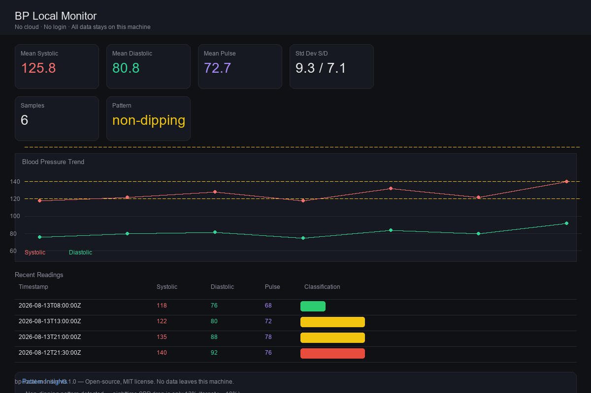
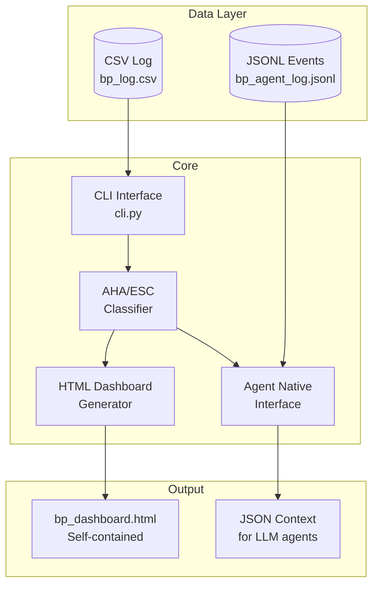

**Deterministic blood pressure monitoring. No cloud. No login. No external uploads.**

---

## 🖼️ Dashboard Preview


*Self-contained HTML dashboard — no external JS/CSS, works offline. Trend charts, statistics, and pattern detection in a single file.*

---

## 🏗️ Architecture



---

## ✨ Features

- **AHA/ESC-aligned classification** — deterministic thresholds, no ML
- **Self-contained HTML dashboard** — open in any browser, zero dependencies
- **Pattern detection** — non-dipping, nocturnal elevation, high variability
- **Agent-native** — JSON context for LLM terminal agents
- **Two persistence formats** — CSV for humans, JSONL for agents

---

## 🚀 Quick Start

```bash
pip install bp-local-monitor
bp-local add 2026-01-15T08:30 128 82 72 "morning reading"
bp-local trend
bp-local dashboard    # Generates bp_dashboard.html
```

---

## 📊 Pattern Detection

| Pattern | Description |
|---------|-------------|
| **Non-dipping** | Nocturnal BP doesn't fall sufficiently |
| **Nocturnal elevation** | Nighttime readings elevated |
| **High variability** | Erratic readings over window |
| **Frequent elevation** | Sustained high readings |

---

## 📁 Project Structure

```
bp-local-monitor/
├── assets/
│   └── dashboard-preview.png        # README screenshot
├── src/bp_monitor/
│   ├── cli.py                       # Command-line interface
│   ├── classifier.py                # AHA/ESC classification
│   ├── dashboard.py                 # HTML generator
│   ├── schemas.py                   # Pydantic models
│   ├── storage.py                   # CSV + JSONL persistence
│   └── agent.py                     # Agent-native interface
├── tests/
├── pyproject.toml
└── README.md
```

---

## ⚠️ Not a Medical Device

This is a **logging and analysis tool** only. Always consult a physician.

---

## 📄 License

MIT © Md Sadman Bin Masud
