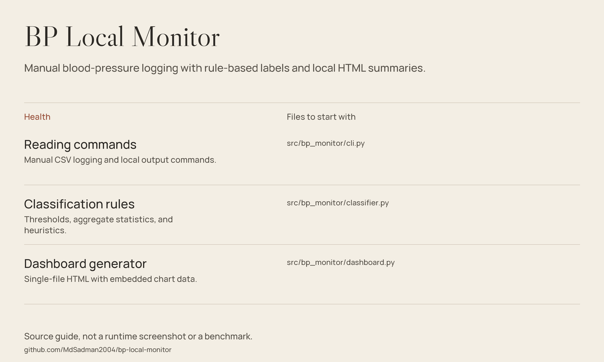

# BP Local Monitor — Local Readings, Explicit Rules



*Source guide drawn from the files in this repository; not a runtime screenshot or a fresh benchmark.*

**A Python CLI for manually logging blood-pressure readings and reviewing local summaries.**
Readings are stored in CSV, classifications follow explicit code thresholds,
and the dashboard generator writes a single HTML file. An additional interface
exports JSON context for agents without implementing an LLM service.

> **Not a medical device or diagnostic tool.** Consult a qualified clinician
> about readings and symptoms. Do not use these heuristics to change treatment
> or delay urgent care.

## What the source implements

| Feature | What it does |
|---|---|
| Validated readings | Pydantic fields check numeric ranges, timestamp syntax, and diastolic below systolic. |
| Local CSV storage | Preserve timestamps, pressure, optional pulse, notes, and source labels. |
| Rule-based labels | Classify readings without machine learning. |
| Summary statistics | Compute means, standard deviations, morning/evening averages, and heuristic patterns. |
| HTML output | Embed chart data, styling, and canvas drawing code in `bp_dashboard.html`. |
| Agent context | Export summary data, recent classified readings, and a prompt fragment. |

## Getting started

Requires **Python 3.10+**. Install from this checkout rather than assuming a
published package exists. Runtime dependencies are `pydantic>=2.0` and `rich>=13.0`.

```bash
git clone https://github.com/MdSadman2004/bp-local-monitor.git
cd bp-local-monitor
python -m venv .venv
```

Activate the environment (`source .venv/bin/activate` on POSIX;
`.venv\Scripts\Activate.ps1` in Windows PowerShell), then:

```bash
python -m pip install -e .
bp-local
```

The no-argument command displays usage. The following readings are **synthetic
examples**, not medical recommendations or recorded patient data:

```bash
bp-local add 2026-01-15T08:30:00Z 128 82 72 "synthetic example"
bp-local list
bp-local trend
bp-local dashboard
bp-local agent-context
```

Open the generated `bp_dashboard.html` locally. Default files are created in
the working directory, not automatically in the installed package directory.

For the regular reading commands, put the file option **before** the subcommand:

```bash
bp-local --file example-readings.csv list
bp-local --file example-readings.csv trend
```

`bp-local log` and `bp-local agent-log` append classifications to JSONL.
Repeating either command logs the readings again; there is no deduplication.

## Source guide

| File | Purpose |
|---|---|
| [Package configuration](pyproject.toml) | Python version, dependencies, and console entry points. |
| [CLI](src/bp_monitor/cli.py) | Reading commands and argument ordering. |
| [Classifier](src/bp_monitor/classifier.py) | Actual thresholds, statistics, and pattern rules. |
| [Data models](src/bp_monitor/schemas.py) | Validation and output contracts. |
| [Storage](src/bp_monitor/storage.py) | CSV reading and writing. |
| [Dashboard](src/bp_monitor/dashboard.py) | Single-file HTML generator. |
| [Agent interface](src/bp_monitor/agent.py) | JSON context, event logs, and prompt fragment. |
| [Tests](tests/test_bp_local_monitor.py) | Included classification, storage, and context checks. |

## Scope & limitations

- The comments describe AHA/ESC alignment, but this is not a validated clinical
  guideline implementation. The crisis branch uses `>=180` or `>=120`, while
  comments and the agent prompt say `>180` or `>120`.
- `rolling_stats` labels a window but does not filter readings by date;
  the CLI summary uses all loaded samples.
- “Non-dipping” compares morning and evening values, not measured sleep periods.
  “Nocturnal elevation” is an overall-mean heuristic, not a nighttime assessment.
- Timestamp syntax is checked, but UTC is not enforced or normalized.
- Custom CSV paths are not correctly forwarded to the agent subcommands.
  The separate `bp-local-agent` entry point also does not read process arguments.
  Use the main `bp-local agent-context` with its default CSV for now.
- Local CSV, JSONL, and HTML outputs contain sensitive health information and
  are not encrypted by this tool. External agents can still disclose exported data.
- No sensor ingestion, clinical validation, or test run is asserted by this refresh.

## License

Original README notice: `MIT © Md Sadman Bin Masud`.
No license file is present. `pyproject.toml` declares MIT as metadata, but no
standalone license text is included. This refresh preserves those declarations
without adding license terms or changing the project's licensing.
